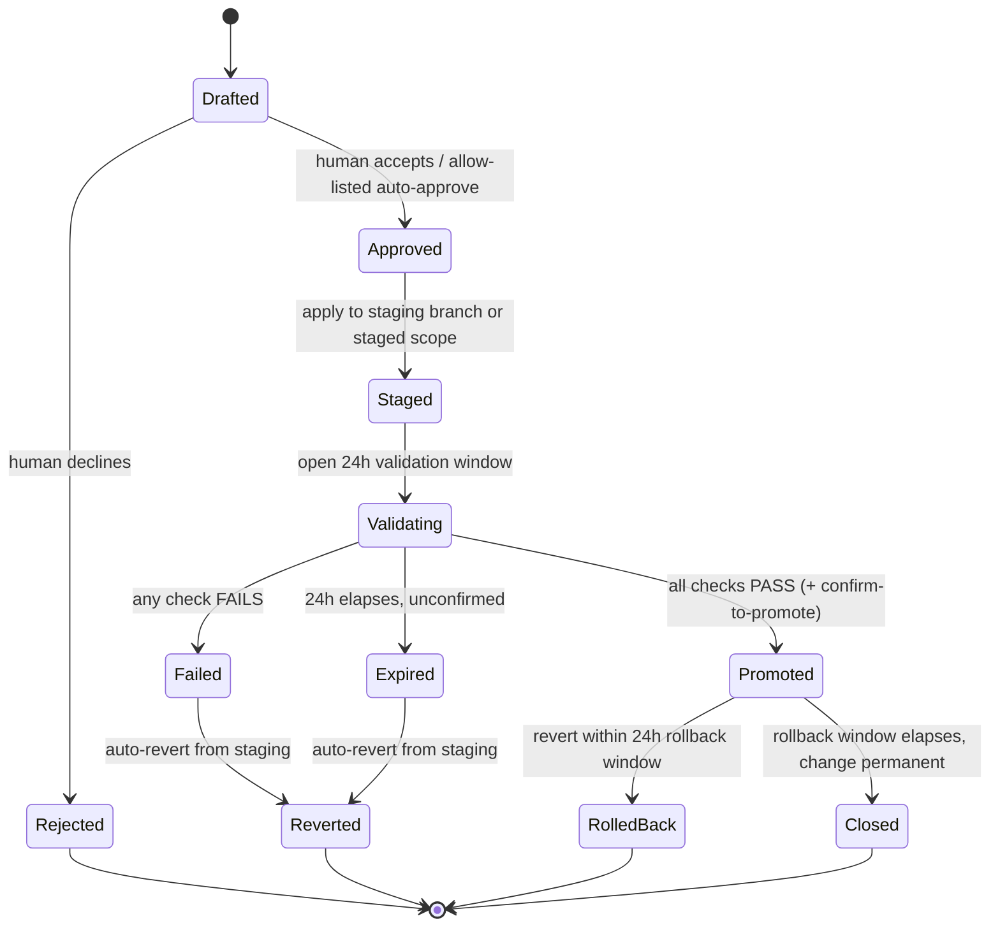
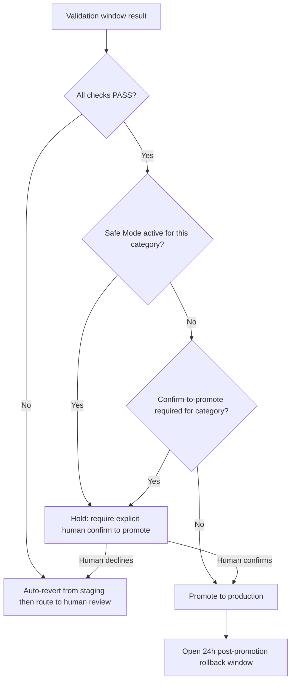

# Sentinel — Mitigation Safety & Staged Rollout
## System Specification / Requirement Sheet (Extension Module to the Sentinel SRS v1.0)

| | |
|---|---|
| **Version** | 1.0 (Draft) |
| **Status** | For Stakeholder Review |
| **Parent Document** | Sentinel SRS v1.0 — §11 (Bot Mitigation), §12 Group E, §17, §19, §21, §22, §23, §25 |
| **Module Owner** | Mitigation Agent |
| **Document Date** | June 2026 |

**Purpose.** This sheet specifies the safety mechanism that governs every action the Mitigation Agent takes: no approved change reaches production directly; it is first applied to a **staging branch / staged scope**, held in a **24-hour validation window**, and promoted only after it is confirmed valid. Any executed change can be **reverted** in a single action, and the system can fall back to **Safe Mode** — suspending all autonomy in favor of human approval — automatically or on demand. This is the concrete realization of the program's positioning: *a human-in-the-loop tool closes the loop only when the change has proven itself safe.*

**Relationship to the parent SRS.** This module supersedes and strengthens two existing requirements:
- `FR-027` ("execute fully automated resolution") is now realized as **stage → validate → promote**, never a direct production write.
- `FR-028` (rollback within 24h) is subsumed and strengthened by `MS-11`–`MS-15` below.

**Upstream gate (unchanged).** A mitigation only becomes *eligible* for the allow-listed auto-approve path after it clears the upstream confidence/precedent eligibility gate defined in the Classification/Diagnosis layer. Staging + validation sits **after** that gate as a second, independent line of defense — eligibility decides whether a bot *may* act; staging decides whether the action *survives contact with reality* before customers feel it.

---

## 1. Definitions

| Term | Definition |
|---|---|
| **Staging branch / staged scope** | An isolated target where an approved mitigation is applied **before** production. For code-type fixes, a literal Git branch + CI run, never merged to main until promoted. For config/infrastructure actions (e.g., quota/capacity), a non-production scope where feasible, otherwise a **validation hold** with a registered, tested revert procedure attached before any production effect. |
| **Validation window** | A bounded, configurable period (**default 24 hours**) during which a staged change must be confirmed valid against a defined checklist before it can be promoted. |
| **Promote** | The single transition that applies a validated staged change to production. The only path to a production effect. |
| **Revert** | Returning a staged change to the pre-change state. Trivial in staging; in production it uses the registered rollback path. |
| **Rollback** | A revert applied to an already-**promoted** change, within the post-promotion rollback window. |
| **Safe Mode** | An operating posture (system-wide or per-category) in which all auto-execution is suspended and every mitigation falls back to *Bot-Drafts-Human-Approves* or *Human-Only*. Default-on at start/restart; never self-clears. |
| **Guard condition** | A configurable threshold (validation-failure rate, rollback rate, decline rate, telemetry breach) that, when tripped, triggers an automatic revert and/or Safe Mode entry. |

---

## 2. Mitigation Action Lifecycle (State Machine)

Every mitigation action moves through an explicit, fully-logged state machine. No state reaches production except `Promoted`, and `Promoted` is reachable only through `Staged → Validating`.

**Two fail-safe defaults are visible in the graph:** an unconfirmed window does **not** auto-promote (it `Expire`s and reverts), and a failed check **auto-reverts** rather than waiting for a human to notice.

---

## 3. Promotion Decision (incl. Safe Mode interaction)

---

## 4. Functional Requirements

ID format `MS-xx`. Priority: Must / Should / Could.

### Group A — Lifecycle & "No Direct-to-Prod"

| ID | Requirement | Priority | Acceptance Criteria |
|---|---|---|---|
| MS-01 | Every mitigation action progresses through the explicit state machine in §2 | Must | Each transition is timestamped and audited; no action can skip `Staged` or `Validating` to reach `Promoted`. |
| MS-02 | No approved mitigation is applied directly to production | Must | Production effect occurs **only** via the `Promote` transition after a successful validation window; enforced server-side at the Orchestrator, not in the UI. |
| MS-03 | Each action carries its type (`code` / `config`) so the correct staging and validation path is selected | Must | Type is set at draft time; staging mechanism (§Group B) is chosen automatically from type. |

### Group B — Staging Branch / Staged Scope

| ID | Requirement | Priority | Acceptance Criteria |
|---|---|---|---|
| MS-04 | Code-type mitigations are applied to an isolated staging branch and run through CI; never merged to main until `Promoted` | Must | A branch is created per action, named/traceable to `ticket_id` + `action_id`; the CI run is linked to the staging record. |
| MS-05 | Config/infrastructure mitigations are applied to a non-production scope where feasible; where no non-prod scope exists, the action enters a **validation hold** with a registered, tested revert procedure **before** any production effect | Must | Every config mitigation has a registered revert handle prior to `Staged`; an action with no revert handle cannot leave `Approved`. |
| MS-06 | Each staged deployment produces a staging record: artifacts, target (branch/scope), parameters/diff, expected outcome, and revert handle | Should | Record is queryable by `action_id`; missing required fields block the transition rather than being silently skipped. |
| MS-07 | The staging environment is isolated from production data and blast radius | Must | Staging cannot write to production resources; verified by deployment-time scope check. |

### Group C — 24-Hour Validation Window

| ID | Requirement | Priority | Acceptance Criteria |
|---|---|---|---|
| MS-08 | Every staged change enters a validation window before promotion | Must | Window duration is configurable **without code deploy**; **default 24 hours**; applied automatically on `Staged → Validating`. |
| MS-09 | Validity is determined by a defined, inspectable checklist | Must | Minimum checks: (a) generated tests pass in CI [code]; (b) existing regression suite passes; (c) affected-component health/telemetry within configured bounds; (d) no new correlated incidents opened against the same component/customer during the window; (e) human sign-off where the category requires it. Result is a structured PASS/FAIL with a **per-check breakdown**. |
| MS-10 | If validation does not complete successfully within the window, the change is **automatically reverted** and routed to human review — **never** auto-promoted on timeout | Must | On window expiry without overall PASS: `Validating → Expired → Reverted`; auto-revert executes; assigned engineer + lead notified; event logged. |
| MS-11 | Validation status is queryable per action and visible on the dashboard | Should | Surfaces per-check status, elapsed time, and time remaining in the window. |
| MS-12 | Promotion may be gated behind explicit human confirmation per category even when checks pass (`confirm-to-promote`) | Should | `confirm-to-promote` is configurable per category; **ON by default for the MVP** to stay consistent with mandatory-human-approval framing. |

### Group D — Revert / Rollback

| ID | Requirement | Priority | Acceptance Criteria |
|---|---|---|---|
| MS-13 | Any executed mitigation (staged or promoted) can be reverted by an authorized human in a single action | Must | One-click revert works in both staging and post-promotion states; authenticated via Azure AD (per SRS §22). |
| MS-14 | Every mitigation registers a **tested** rollback path before it is allowed to execute | Must | No action transitions to `Staged` without an associated, validated revert handle/procedure; enforced server-side. |
| MS-15 | Post-promotion rollback is available for a configurable window, **default 24 hours**, after promotion | Must | Rollback window is configurable; default 24h; rollback within the window is a single action. |
| MS-16 | Guard-triggered automatic rollback: if post-promotion telemetry breaches configured thresholds within the rollback window, the system auto-reverts — or, in Safe Mode, recommends revert for one-click human confirm | Should | Guard thresholds configurable; auto-revert is logged with the triggering metric and value. |
| MS-17 | Revert is idempotent | Must | Re-issuing a revert that already completed is a no-op, not an error. |
| MS-18 | Every revert/rollback is logged with actor (human or `guard:<signal>`), reason, pre/post state, and outcome | Must | Entry is reconstructable in a single audit query by `ticket_id` or `action_id`. |

### Group E — Safe Mode

| ID | Requirement | Priority | Acceptance Criteria |
|---|---|---|---|
| MS-19 | The system supports a Safe Mode posture, settable system-wide and per-category, suspending all auto-execution and falling back to *Bot-Drafts-Human-Approves* / *Human-Only* | Must | Togglable by an authorized operator; takes effect within seconds; current mode visible on the dashboard and logged. |
| MS-20 | Safe Mode is entered **automatically** when configured guard conditions trip (e.g., validation-failure rate, rollback rate, or decline rate exceeds a threshold over a rolling window) | Must | Auto-trigger thresholds configurable; entry event logged with the triggering signal; operator alerted. |
| MS-21 | In Safe Mode, staged changes already in a validation window continue to validate but require explicit human confirmation to promote regardless of automated result | Should | No auto-promotion occurs while Safe Mode is active for the relevant category. |
| MS-22 | Exiting Safe Mode requires an explicit, logged human action — the system never self-clears | Must | Exit is logged with actor + timestamp; no code path auto-exits Safe Mode. |
| MS-23 | Safe Mode is the **default** posture on system start/restart and after any unhandled mitigation-execution error, until explicitly cleared | Should | Fresh start → Safe Mode ON; unhandled execution error → Safe Mode ON for the affected category. |

### Group F — Audit, Observability, Notification

| ID | Requirement | Priority | Acceptance Criteria |
|---|---|---|---|
| MS-24 | Every state transition, validation result, revert, and Safe Mode change is appended to the immutable audit log with full context | Must | Append-only; queryable by `action_id`, `ticket_id`, actor, and transition type (extends SRS §23). |
| MS-25 | Dashboard surfaces mitigation-safety health | Should | Shows: count of actions in each state, validation pass/fail rate, mean time-in-validation, rollback rate, count of expired/auto-reverted actions, and current Safe Mode status. |
| MS-26 | Engineer + lead are notified on validation failure, window expiry/auto-revert, guard-triggered rollback, and Safe Mode entry | Should | Notification includes `action_id`, `ticket_id`, the triggering condition, and the resulting state. |

---

## 5. Non-Functional Requirements

| Category | Requirement | Target / Notes |
|---|---|---|
| Integrity | Single promotion path | Production effect is reachable only through the validated pipeline; no out-of-band write path exists. |
| Safety defaults | Fail toward human / revert | Every timeout, error, or ambiguity resolves toward *do-not-promote / revert / require-human* — never toward more autonomy. |
| Security | Revert handle protection | Revert handles/procedures encrypted at rest; revert and promote actions authenticated via Azure AD (SRS §22). |
| Performance | Bounded validation checks | Check execution is time-bounded so a result is meaningful within the window (e.g., CI run completes well inside the configured window). |
| Reliability | Staging isolation | Staging cannot affect production data or availability; failure in staging never blocks the manual D365 queue (consistent with SRS fail-open posture). |
| Observability | Window visibility | Time-in-validation and time-remaining are observable in real time per action. |

---

## 6. Data Model Additions

**`staging_deployment`**

| Field | Description |
|---|---|
| deployment_id, action_id, ticket_id | Linkage |
| type | `code` / `config` |
| target | Staging branch name (code) or resource scope (config) |
| artifacts_ref | Diff, generated tests, parameters |
| expected_outcome | What "valid" looks like for this change |
| revert_handle | Registered, tested rollback procedure (mandatory) |
| created_at, status | Lifecycle timing and current state |

**`validation_result`**

| Field | Description |
|---|---|
| validation_id, deployment_id | Linkage |
| window_start, window_end | `window_end = window_start + configured duration` (default 24h) |
| checks[] | `{name, status, detail, evaluated_at}` per check |
| overall_status | `PENDING` / `PASS` / `FAIL` / `EXPIRED` |
| promoted_at, reverted_at | Outcome timestamps |

**`safe_mode_state`**

| Field | Description |
|---|---|
| scope | `system` or `category:<name>` |
| active | Boolean |
| entered_at, entered_by | `human:<id>` or `guard:<signal>` |
| exited_at, exited_by | Always `human:<id>` (never auto) |
| reason | Triggering signal or operator note |

**`bot_action_log`** (extends SRS §14) — add `state_history[]` (transition, actor, timestamp), `validation_id`, `rollback_window_end`.

---

## 7. API Additions (extends SRS §21)

| Method | Endpoint | Description |
|---|---|---|
| POST | /tickets/{id}/mitigate/stage | Apply an approved action to its staging branch/scope and open the validation window |
| GET | /tickets/{id}/mitigate/validation | Current validation status: per-check breakdown, elapsed, time remaining |
| POST | /tickets/{id}/mitigate/promote | Promote a validated staged change to production (subject to `confirm-to-promote` / Safe Mode) |
| POST | /tickets/{id}/mitigate/revert | Revert a staged or promoted change (idempotent) |
| GET | /mitigation/safe-mode | Current Safe Mode status (system + per category) |
| POST | /mitigation/safe-mode | Enter/exit Safe Mode (authorized; logged) |

*Migration note:* the SRS `POST /mitigate/execute` is replaced by `stage → promote`; `POST /mitigate/rollback` is generalized to `mitigate/revert`.

---

## 8. Acceptance Test Scenarios

These map directly to the two MVP demo scenarios in SRS §26 (capacity/quota + software defect).

**S1 — Quota approval (rule-based, allow-listed).**
Approved → `Staged` as a validation hold with a registered revert procedure → 24h window runs entitlement check, target-region capacity check, "no active regional capacity incident," and "no new correlated tickets" → all PASS → `confirm-to-promote` (MVP: ON) → human confirms → provisioned. *Negative:* simulate a guard telemetry breach within the rollback window → `MS-16` auto-revert fires and is logged.

**S2 — Backend software defect (Hybrid).**
Human accepts → code applied to staging branch + CI → generated tests pass, regression suite passes, component telemetry nominal, no new correlated incidents → `Promoted` (PR merged) within the window. *Negative:* one generated test fails in CI → `Validating → Failed → Reverted` (branch auto-discarded) → ticket routed to manual diagnosis with the bot's draft retained.

**S3 — Window expiry (proves "never auto-promote on timeout").**
Staged change where telemetry is insufficient to confirm within 24h → `Expired → Reverted` → human review. No production effect ever occurs.

**S4 — Safe Mode auto-trip.**
Validation-failure rate exceeds threshold over the rolling window → system enters Safe Mode (`MS-20`) → subsequent allow-listed actions fall back to human approval; in-flight validations continue but require manual promote (`MS-21`) → operator clears Safe Mode with an explicit logged action (`MS-22`).

---

## 9. Open Items / Assumptions to Confirm

1. **Config "staging" mechanism per action type.** `MS-05` assumes either a non-prod scope or a validation hold; the exact revert procedure for each runbook (quota increase, VM restart, disk expansion) must be defined and tested by the runbook owner. *Confirm with CSS ops.*
2. **Validation telemetry source.** `MS-09(c)` assumes an existing component-health feed (e.g., Azure Monitor / App Insights). *Confirm the metric source and bounds per component.*
3. **Independent tuning of the two 24h windows.** Validation-before-promote (`MS-08`) and rollback-after-promote (`MS-15`) both default to 24h. *Confirm whether these should be tuned independently per severity/category.*
4. **MVP promotion posture.** `confirm-to-promote` is set ON for the MVP to preserve mandatory human approval; this is the configurable knob that later enables graduated autonomy (SRS §27).
