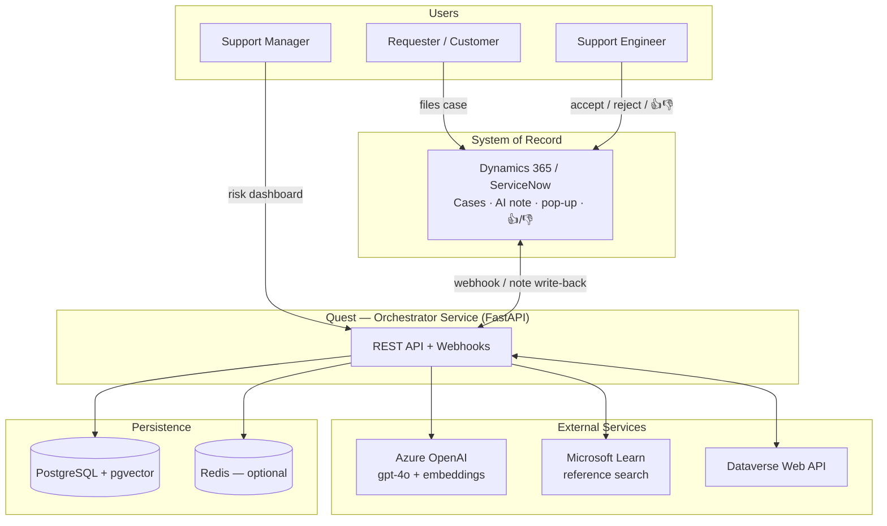
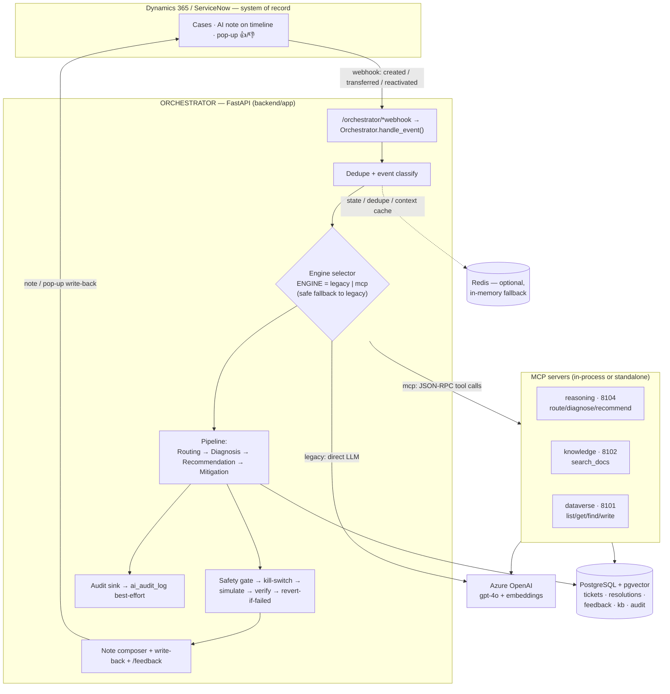
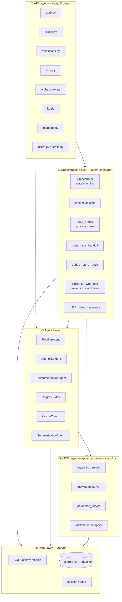
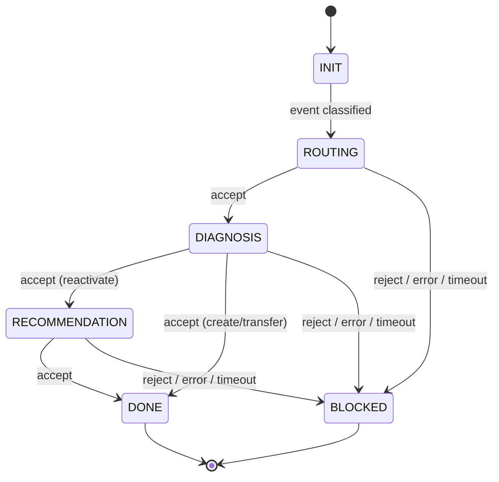
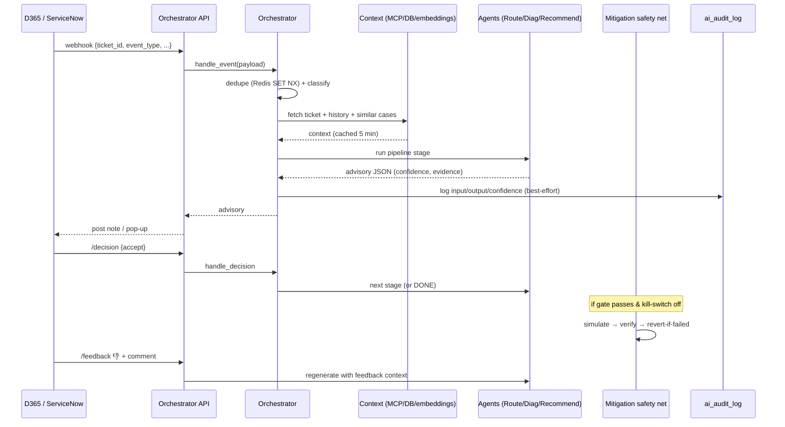
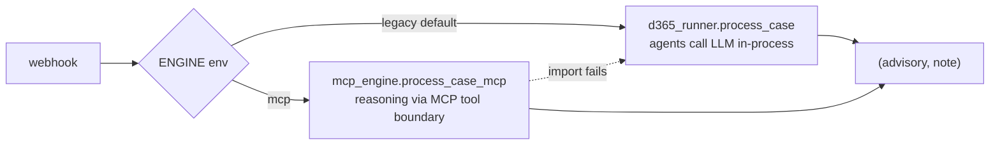
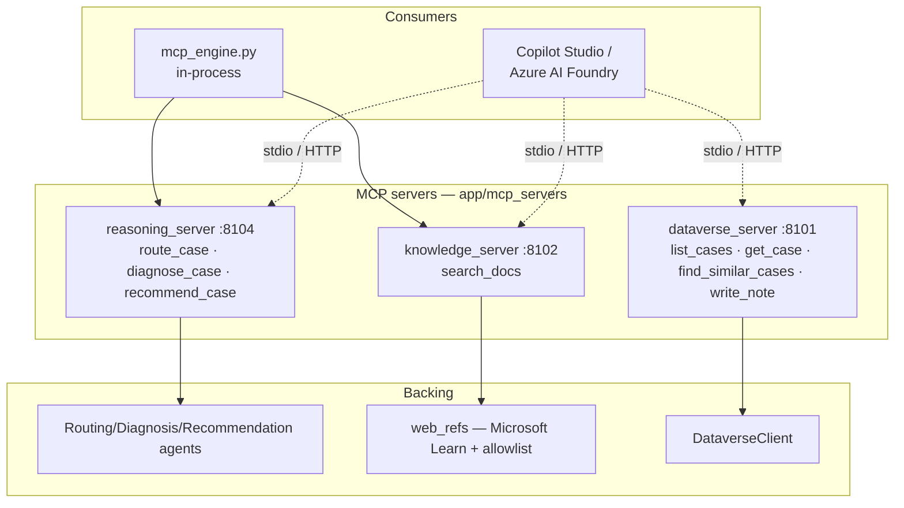
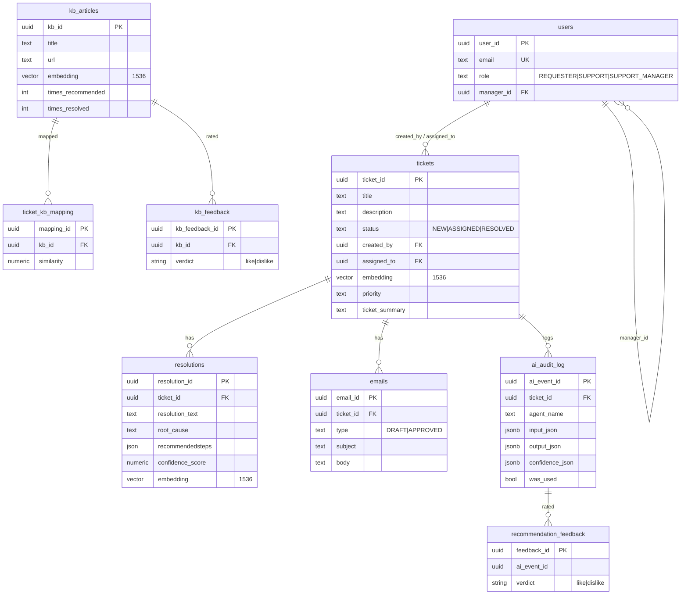
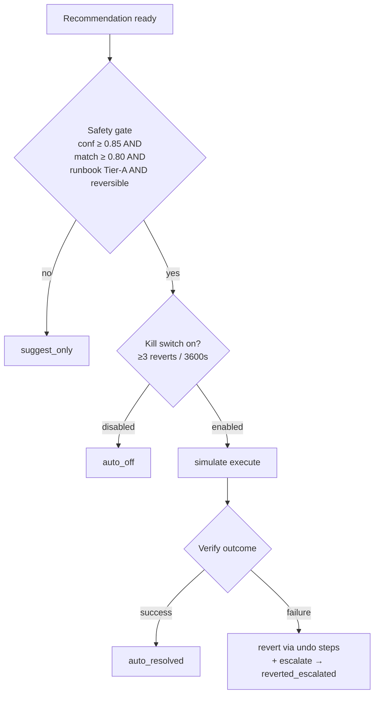
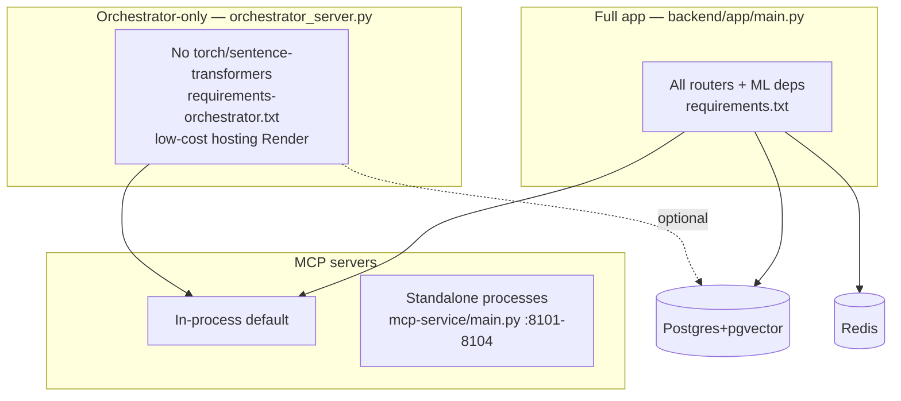

# Quest — AI Support Agent: Architecture Design

> **System:** AI Support Agent for Dynamics 365 / ServiceNow — automated triage, diagnosis, recommendation, and guarded auto‑remediation of support cases.
> **Scope of this document:** the full technical architecture — system context, component design, data model, control/data flow, the dual reasoning engine, the MCP tool layer, the safety net, deployment topology, and the design decisions behind them.

---

## 1. Executive summary

When a support Case is created (or transferred / reactivated) in **Dynamics 365** or **ServiceNow**, Quest automatically:

1. **Routes** it to the right support team and picks an available, skill‑matched, on‑shift engineer.
2. **Diagnoses** the root cause, grounded in the closest *historically resolved* cases (semantic similarity, not generic text).
3. **Recommends** a **Hot Fix** (restore now) and an **Ultimate Fix** (permanent), with reference links restricted to a trusted‑domain allowlist.
4. Optionally, for **low‑risk, high‑confidence** cases, attempts **guarded auto‑remediation** with verify‑then‑revert and a kill switch.
5. Binds all of it into **one note** written back onto the Case, with 👍/👎 feedback that regenerates an improved answer.

Everything is logged to an **audit trail**, and **every external dependency is optional** — the pipeline degrades gracefully rather than failing the case.

**Tech stack:** FastAPI (Python) · PostgreSQL + pgvector · Redis (optional) · Azure OpenAI (`gpt‑4o` + embeddings) · Model Context Protocol (MCP) tool servers · Dataverse Web API · Microsoft Learn search.

---

## 2. System context

**Actors**

| Actor | Interaction |
|---|---|
| **Requester** | Files the case in D365/ServiceNow. |
| **Support Engineer** | Reads the AI note, clicks Accept/Reject and 👍/👎, sends customer emails. |
| **Support Manager** | Monitors the SLA‑risk dashboard; approves suggested workflows. |
| **D365 / ServiceNow** | System of record; source of webhook events and target of the AI note. |

---

## 3. High‑level architecture

The orchestrator is a **stateless FastAPI service**. Two calls drive the ServiceNow flow — `/webhook` (an event happened) and `/decision` (the engineer responded) — while D365 uses `/d365-webhook` plus a background poller for hands‑off automation.

---

## 4. Component & layer architecture

| Layer | Responsibility | Key modules |
|---|---|---|
| **① API** | HTTP surface: auth, ticket CRUD, MCP analysis, webhooks, KB, manager dashboard | `app/api/routers/*` |
| **② Orchestration** | Event classification, dedupe, state machine, pipeline sequencing, engine selection, SLA/roster/handoff, note composition, safety net | `app/orchestrator/*` |
| **③ Agents** | The reasoning units: routing, diagnosis, recommendation, insights, email drafting, summarization | `app/agents/*`, `app/orchestrator/agents.py` |
| **④ MCP** | Every agent capability re‑exposed as a discoverable MCP tool for external agents (Copilot Studio / Azure AI Foundry) and for the `mcp` engine path | `app/mcp_servers/*`, `app/mcp/*` |
| **⑤ Data** | pgvector‑backed corpus of tickets, resolutions, KB, feedback, audit log | `app/db/*` |

---

## 5. Ticket lifecycle — state machine

**Pipeline by event type** (`states.py`):

| Event | Pipeline | Use case |
|---|---|---|
| `create` | `routing → diagnosis` | New ticket |
| `transfer` | `routing → diagnosis` | Reassignment |
| `reactivate` | `routing → diagnosis → recommendation` | Reopened ticket |

Each agent posts a JSON **advisory** back to the case; the engineer's **Accept** advances to the next agent, **Reject** drops to `BLOCKED` and flags the override for retraining. After an accepted recommendation, an optional **health‑check probe** re‑fires ~15 min later if symptoms persist (capped at 2 follow‑ups).

---

## 6. End‑to‑end data flow (case → outcome)

**Sequence highlights**

1. **Dedupe first** — webhook + Power Automate retries + poller can all fire the same case within ~20s; Redis `SET NX` (10‑min TTL) guarantees one note.
2. **Context is cached** — ticket + history cached 5 min per `ticket_id`; the event is always rebuilt fresh.
3. **Diagnosis is grounded** — similarity search over the `resolutions` corpus (cosine over pgvector), not free‑form generation.
4. **References are allowlisted** — recommendation links validated against `trusted_domains.json` / Microsoft Learn only.
5. **Feedback loops back** — 👎 re‑runs the relevant agent with the engineer's comment injected as extra context.

---

## 7. Dual reasoning engine (the fallback flag)

Both engines funnel through the **same** `d365_runner.process_case`, so orchestration, confidence blend, grounding cap, and note formatting **never diverge** — only *how each agent's answer is produced* differs. `ENGINE=mcp` routes reasoning through the MCP tool servers (the governed surface reused by Copilot Studio); if the MCP layer can't be imported (e.g. a slim deploy), it **fails safe to legacy**. This lets MCP be adopted incrementally and rolled back instantly via one env flag, with zero behavioral drift.

---

## 8. Agents

| Agent | Module | Responsibility | Output shape |
|---|---|---|---|
| **RoutingAgent** | `orchestrator/agents.py` | Classify into a K8s/Karpenter support team (10 categories) + pick an on‑shift, skill‑matched engineer | `recommended_team`, `assigned_engineer{}`, `confidence`, `reason` |
| **DiagnosisAgent** | `orchestrator/agents.py` | Root cause grounded in nearest historical cases | `root_cause`, `grounded`, `confidence` |
| **RecommendationAgent** | `orchestrator/agents.py` | Hot Fix + Ultimate Fix + allowlisted reference links | `hot_fix{}`, `ultimate_fix{}`, `trusted_links[]`, `confidence` |
| **InsightsBuddy** | `agents/insights.py` | In‑app analysis: similarity search, KB match, recommended steps, root cause + recommendation | `similar_tickets`, `recommended_steps`, `kb_recommendations`, `root_cause` |
| **CommCoach** | `agents/communication.py` | Draft → edit → approve → send customer emails; log resolutions; flag stale comms | `Email` (DRAFT/APPROVED), `Resolution` |
| **SummarizationAgent** | `agents/summarization_agent.py` | 1–3 sentence ticket summary + error‑code extraction | `summary`, `error_codes[]` |

**Roster & SLA** — `roster.py` picks engineers in tiers (on‑shift+specialty → on‑call+specialty → any on‑shift → any on‑call → least‑loaded with SLA‑risk flag), respecting each engineer's own timezone/shift. `sla.py` maps priority to Tier 1/2/3 (15 min/4 h · 60 min/8 h · 240 min/24 h), failing open to Tier 3 for unparsed priorities. `handoff.py` reassigns and posts a conversation digest when an assignee's shift ends mid‑ticket.

---

## 9. MCP (Model Context Protocol) layer

Each server runs **in‑process by default** (imported callables) or as a **standalone process** over stdio/HTTP (`_runtime.py` reads `MCP_TRANSPORT` / `MCP_HOST` / `MCP_PORT`) for out‑of‑process tool isolation. The `MCPServer` wrapper (`app/mcp/server.py`) composes InsightsBuddy + CommCoach for the in‑app analysis/email workflow. Exposing every capability as a discoverable tool means the same governed surface serves both the live `mcp` engine and external LLM agents.

---

## 10. Data model

**Notable design points**

- **pgvector everywhere it matters** — `tickets`, `resolutions`, `kb_articles` carry `vector(1536)` embeddings; an HNSW cosine index accelerates similarity search over KB resolutions.
- **Outcome‑based KB ranking** — `kb_articles.times_recommended` / `times_resolved` / `total_resolution_hours` yield computed `success_rate` and `avg_resolution_hours`, so KB re‑ranks by *proven* value, not static metadata.
- **Feedback tables** — `kb_feedback` and `recommendation_feedback` capture 👍/👎 (+ comment) and drive regeneration and re‑ranking.
- **Best‑effort audit** — `ai_audit_log` records every decision (input/output/confidence/supporting incident IDs/`was_used`); a write failure never breaks the case.

---

## 11. External integrations & graceful degradation

| Dependency | Used for | If unavailable |
|---|---|---|
| **Azure OpenAI (gpt‑4o)** | Agent reasoning (`llm.chat_json`) | Deterministic fallback responses |
| **Azure OpenAI embeddings** | Similarity search (`embeddings.embed_*`) | Falls back to a small set of reference tickets |
| **Dataverse Web API** | Read cases / write notes (`DataverseClient`, OAuth2 client‑creds) | `available()` → False; in‑memory demo path |
| **Microsoft Learn** | Reference links (`web_refs.search_refs`) | Links omitted; recommendation still produced |
| **PostgreSQL + pgvector** | Persistence + vector search | Works without persistence/audit (NFR‑6) |
| **Redis** | Event dedupe + state + context cache | In‑memory dict fallback (state lost on restart) |

> **Design principle (NFR‑1/3):** a failure in any one stage degrades *that* stage rather than aborting the case; when in doubt (low confidence, no precedent, irreversible action) the system **suggests rather than acts**.

---

## 12. Safety net — guarded auto‑remediation

The mitigation path always ends in **exactly one** of `suggest_only`, `auto_off`, `auto_resolved`, `reverted_escalated` — never a silent applied fix. It is judged by its **own kill switch** (trips after repeated reverts), not by the confidence score that admitted it, because "a confident wrong fix" is exactly the failure mode the net exists to catch. Runbooks and the trusted‑domain allowlist are **data** (`config/*.json`), editable without a redeploy.

---

## 13. Deployment topology

- **Full app** — every router + ML dependencies; the complete in‑app experience.
- **Orchestrator‑only** — slim deploy without heavy ML libs for cheap always‑on hosting (NFR‑5); same orchestrator router, optional DB.
- **MCP** — in‑process by default; standalone processes (`mcp-service/`, ports 8101–8104) when tool isolation is wanted. Local dev via `docker-compose.yml` (pgvector + redis).

---

## 14. Key design decisions

| Decision | Rationale |
|---|---|
| **Dual engine, identical downstream logic** | Adopt MCP incrementally, roll back instantly (env flag), zero behavioral drift. |
| **Config externalized, thresholds in env** | Runbooks/domains change often (ops content); safety thresholds stay visible in deploy config. |
| **Verify‑then‑revert, not verify‑then‑trust** | Auto‑remediation is policed by its own kill switch, catching confident‑but‑wrong fixes. |
| **Best‑effort persistence** | The case pipeline is the product; the audit trail must never be a single point of failure. |
| **Grounded reasoning only** | Diagnosis cites the team's real past cases; references come from an allowlist — no hallucinated fixes/links. |
| **Shift‑aware assignment** | The SLA clock cares whether the assignee is *awake now*, not what timezone the customer filed from. |
| **Stateless + optional stores** | Runs with or without Postgres/Redis for low‑friction environments (NFR‑6). |

---

## 15. Known gaps / roadmap

- `dataverse_server.py` remediation execution is **simulated** — real Dataverse/Graph/Defender API calls are Phase‑3 placeholders.
- `app/services/` is empty — no custom services beyond agents/orchestrator yet.
- `tests/test_basic.py` is a placeholder; real coverage lives in `backend/app/orchestrator/test_orchestrator.py`.
- Bearer‑token auth on the orchestrator webhooks is planned before UAT (open in dev today).
- Next milestone: a real Power Automate "approve‑and‑execute" flow so managers approve suggested workflows — the orchestrator only ever *proposes*, never executes unattended.

---

*Generated from source at `backend/app/` — orchestrator, agents, MCP servers, and data models. Diagrams render on GitHub (Mermaid). A print‑ready PDF version accompanies this document.*
